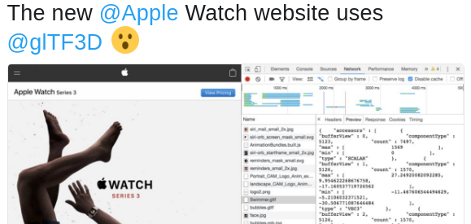
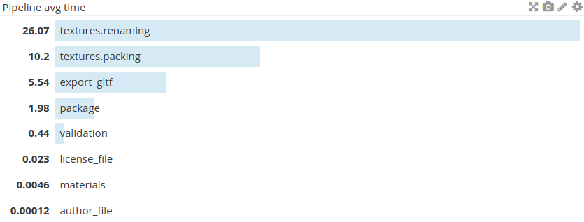
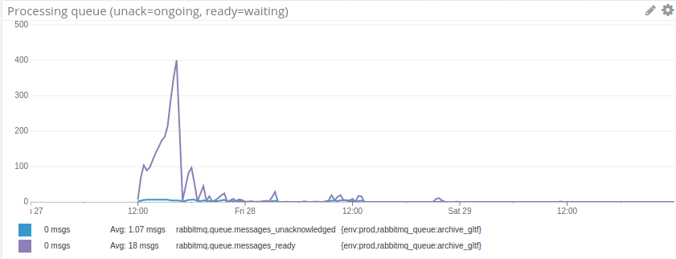

# Algolia meets Marc & vice versa

 Algolia, 2017-09-21 

 

   +   
 

***

[Marc Helbling](https://twitter.com/marchelbling)

Software engineer@[sketchfab.com](http://sketchfab.com)

    

# Previously

  /  /  

***

  

fulguroboom

# Algolia ❤

 product 👫 community 

# Algolia ❤

 product 👫 community 

Milliseconds matter. Size does too!

# Algolia ❤

 product 👫 community 

Milliseconds matter. Size does too! 
⇒  helping Anthony & Sylvain to (re)build the analytics infrastructure?

***

# glTF

* new standard for 3D data transmission
* glTF 1.0 2015/10 →  glTF 2.0 2017/06
* supports all modern 3D features (animation, PBR materials)
* human/machine friendly (JSON + binary buffers)

# A big deal for Sketchfab?

* very good industry adoption
    * major open-source projects
    * new major industry actors
    
  

    * traditional actors _will_ adopt

# A big deal for Sketchfab?

⇒  from a consumer of data to a producer of data

let's generate glTF data for our 100K downloadable models!

# Transcoding 3D

* scene graph: "standard" objects in 3D so good compatibility
* textures: Sketchfab textures are unpacked, glTF textures are mostly packed
* materials: Sketchfab materials are custom, some data not supported by glTF
* animation: not for launch! (3 weeks ETA)

# Import pipeline overview

load user data ⇒  clean ⇒  normalize ⇒  keep 'generic' data ⇒  optimize/compress for viewer  (→  further optimizations on user edits)

# glTF export pipeline overview

load 'generic' data & Sketchfab materials ⇒  convert materials ⇒  pack textures ⇒  write glTF

# Project steps (processing-wise)

1. support (basic) glTF output 
not me

2. add a pipeline transforming 'generic' data into glTF 
me

3. write a texture packing tool 
me

4. write a material transcoder 
not me

5. test & iterate

# Testing 3D

mostly numerical values + ∞ of cases: it's hard! 

# Testing 3D (transcoding)

glTF has a validator ⇒  adding it in the pipeline ensure data readability  
\+ write unit test for 'typical' material conversion  
\+ write basic packing unit tests  

testing transcoding correctness requires comparing renders: 
glTF supported as import format so let's test `render(scene) ?= render(import(export(scene)))`

# Comparing renders

* Sketchfab settings are not all supported (orientation, post-processes, etc.)
* image diff not practical (change of scene representation impacts 3D compression, materials not fully exportable)

⇒  built tools to upload and apply 'presets' (a lacking product feature); use product features to ease manual process (tags + original url)

# Issues

* 'generic' data read failures; we failed at ensuring legacy data validaty in time
    * →  added patchers in the pipeline
* image library failing to extract some image channels
    * dependency not updated for 2+ years, hard to catch up

# Lessons

* user data is always messier than anticipated: do batch test to (implicitely) cover as many cases as possible
* corollary: building automated tools is a must
* data traceability is a must too: timestamps not enough & should not be an after-thought
* major dependencies from lively projects should be updated regularly

***

Thanks for listening! 
Questions?

# Timings

# Launch failure

