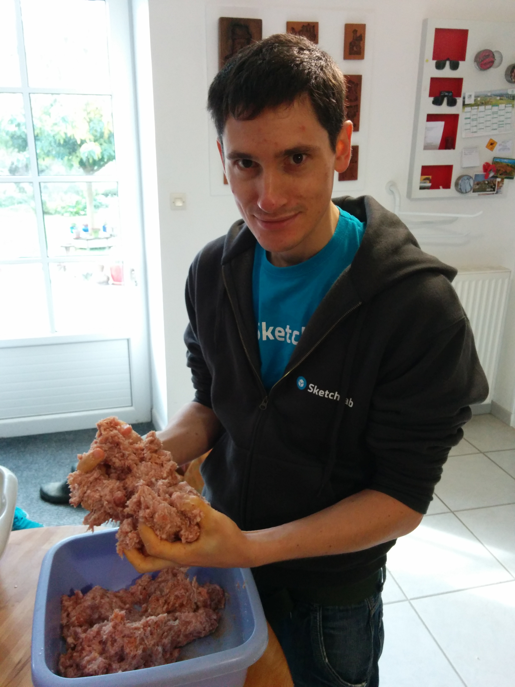

# A practical introduction to git

ÉCP, 2014-11-21

<center></center>

***

[Marc Helbling](https://twitter.com/marchelbling)

Software engineer@[sketchfab.com](http://sketchfab.com)

<center><iframe width="480" height="320" src="https://sketchfab.com/models/263ba71a43aa4347a12893006a70b314/embed?autospin=0.25&autostart=0&ui_infos=0&ui_controls=0&ui_stop=0&transparent=1" frameborder="0" allowfullscreen mozallowfullscreen="true" webkitallowfullscreen="true" onmousewheel=""></iframe></center>

Course material: [a practical git introduction](http://mrchlblng.me/2014/09/practical-git-introduction/)


# why?

<center></center>

<p class="footnote">http://www.phdcomics.com/comics/archive/phd101212s.gif</p>


***

> Version control is the management of changes to collections of documents. Changes are usually identified by a number or letter code termed the "revision". Revisions can be compared, restored, and with some types of files, merged.


***

for each revision, a version control system should provide context:

* **what** is the revision made of?
* **who** made the revision?
* **when** was the revision created (in absolute time and relatively to other revisions)?
* **why** was the revision created?


# vcs timeline

* single-file history (1970’s — ): RCS, SCCS
* multiple files history, centralized (1990’s — ): subversion, cvs, perforce
* multiple files history, decentralized (2000’s — ): **git**, mercurial

<p class="footnote"> see http://ericsink.com/vcbe/html/history_of_version_control.html or <br/> http://en.wikipedia.org/wiki/Comparison_of_revision_control_software</p>


# git

* free/open source/binaries for all major platforms
* decentralized
* handle very large codebase and/or long history (Linux kernel)

* flexible regarding workflows
* [github](https://github.com)
<center></img></center>


# [git: stupid content tracker](http://linux.die.net/man/1/git)

> One of the things that makes Git a pleasure to use for me is that I actually trust what Git does, because what Git does in the end is very, very stupid. — *Linus Torvald*


# basic setup

* git (2.0.0+ for better default behaviors)
* `git config --global user.name "My Name"`
* `git config --global user.email "me@mail.org"`


# repository

```bash
$ git init $HOME/bonjour
Initialized empty Git repository in /Users/marc/bonjour/.git/

$ cd $HOME/bonjour

$ tree -a -I hooks
.
└── .git
    ├── HEAD
    ├── config
    ├── description
    ├── info
    │   └── exclude
    ├── objects
    │   ├── info
    │   └── pack
    └── refs
        ├── heads
        └── tags
```


***

a git repository is just a **hidden folder**!


# first commit!

```bash
$ echo "A dummy app listing ways to just say 'hello'" > README.md
$ git status
On branch master

Initial commit

Untracked files:
  (use "git add <file>..." to include in what will be committed)

    README.md

$ git add README.md
$ git commit -m "First commit"
[master (root-commit) 45de2f7] First commit
 1 file changed, 1 insertion(+)
 create mode 100644 README.md
```


# local vs git

* working copy: files you interact with, one version of each document at a time
* `.git` folder: internal storage where all revisions are stored

Bridge between working copy and git storage is **staging area**


# staging area (1/2)

Let’s add content
```bash
$ mkdir {fr,en}
$ echo 'bonjour' > fr/data
$ echo 'hello' > en/data
$ git status
On branch master
Untracked files:
  (use "git add <file>..." to include in what will be committed)

  en/
  fr/
```


# staging area (2/2)

2 stage commits:

1. select changes to be committed
```
$ git add fr/data
```
2. commit changes

```bash
$ git commit -m "Create french data file"
[master 13d1b4b] Create french data file
 1 file changed, 1 insertion(+)
 create mode 100644 fr/data
```


***

the *staging area* is a **commit draft**

1. make local changes (local file system)
2. stage/unstage changes
3. optionally go to 1.
4. commit the changes (git internal storage)


# let’s dissect a commit

```bash
$ git cat-file -t 13d1b4b
commit

$ git cat-file commit 13d1b4b
tree 7efc3caa79efbab80f45335d4d5f8d2885daff29
parent 45de2f713305a9dcd3e82833653153c19081f36e
author Marc Helbling <marc.d.helbling@gmail.com> 1413120925 +0200
committer Marc Helbling <marc.d.helbling@gmail.com> 1413120925 +0200

Create french data file
```


***

* what

```bash
tree 7efc3caa79efbab80f45335d4d5f8d2885daff29
```

* who

```bash
author Marc Helbling <marc.d.helbling@gmail.com>
committer Marc Helbling <marc.d.helbling@gmail.com>
```

* when

```bash
parent 45de2f713305a9dcd3e82833653153c19081f36e
... 1413120925 +0200
... 1413120925 +0200
```

* why
```bash
Create french data file
```


***

but what’s a tree?

```bash
$ git cat-file tree 7efc3caa79efbab80f45335d4d5f8d2885daff29
100644 README.mdF??Bd???"?C-%D?J?x40000 fr\bbS?"}nC??WJ!

$ git ls-tree 7efc3caa79efbab80f45335d4d5f8d2885daff29
100644 blob 4695a64264e4d7ea22d9432d25449f1e4aeb781e	README.md
040000 tree 5c7f626253bb14227d6e074382ee91574a180f21	fr
```


***

and a blob?

```bash
$ git cat-file blob 4695a64264e4d7ea22d9432d25449f1e4aeb781e
A dummy app listing ways to just say 'hello'

$ git ls-tree 5c7f626253bb14227d6e074382ee91574a180f21
100644 blob 1cd909e05d33f0f6bc4ea1caf19b5749b434ceb3	data

$ git cat-file -p 1cd909e05d33f0f6bc4ea1caf19b5749b434ceb3
bonjour
```


# git objects

* commit: direct acyclic graph of all revisions
* tree: filesystem abstraction (file type, mode & name)
* blob: content (bunch of bytes)
* tag: a commit name


***

**git only has *4* objects!**

Anything else is

* configuration
* low (plumbing)/high (porcelain) level commands


# storage

* loose objects are full content snapshots
* zlib compression
* packfile format (incremental storage for more efficient storage)


# revisions naming

git uses 40 hexadecimal digits SHA-1 to sign every object

```bash
$ cat fr/data | git hash-object --stdin
bd61b2ccb39197cc3a66b43f52a6fed66a237a29
```

uses signature as object filenames
```
$ tree .git/objects/ --matchdirs -P bd
.git/objects/
├── ...
├── bd
│   └── 61b2ccb39197cc3a66b43f52a6fed66a237a29
...
```
and allows to use shorter prefix (as long as unambiguous)


# immutability (1/2)

```bash
$ echo "salut" >> fr/data
$ git add -u && git commit -m "Add more frensh data"
[master 456a082] Add more frensh data

$ git cat-file commit 456a082
tree 77a832b508bd5d2fb7c1eb8999e6e0a9f926434d
parent 13d1b4b062b7a7308553bc504dda2d43d32525ba
author Marc Helbling <marc.d.helbling@gmail.com> 1413123548 +0200
committer Marc Helbling <marc.d.helbling@gmail.com> 1413123548 +0200

Add more frensh data
```

Let’s fix this typo


# immutability (2/2)

```bash
$ git commit --amend -m "Add more french data"
[master dd0f5d6] Add more french data

$ git cat-file commit dd0f5d6
tree 77a832b508bd5d2fb7c1eb8999e6e0a9f926434d
parent 13d1b4b062b7a7308553bc504dda2d43d32525ba
author Marc Helbling <marc.d.helbling@gmail.com> 1413123548 +0200
committer Marc Helbling <marc.d.helbling@gmail.com> 1413725760 +0200

Add more french data
```

* **same** tree, parent & author/committer
* *but* **new** committer timestamp & new message

⇒  new commit ⇔  **immutability**


***

Let’s step back and look at our commit history

```bash
$ git log --graph --oneline
* dd0f5d6 Add more french data
* 13d1b4b Create french data file
* 45de2f7 First commit
```

(notice that "commit history" goes upward: the higher in the graph, the more recent in terms of childhood)


***

<center></center>

# reflog

unreachable commits kept in `reflog` for at least 2 weeks

```bash
$ git reflog
dd0f5d6 HEAD@{0}: commit (amend): Add more french data
456a082 HEAD@{1}: commit: Add more frensh data
13d1b4b HEAD@{2}: commit: Create french data file
45de2f7 HEAD@{3}: commit (initial): First commit
```


***
may the `reflog` be with you

<center></center>


# branches

git main branch in the DAG is called `master`

```bash
$ git branch
* master

$ cat .git/refs/heads/master
dd0f5d6500d72d54747dec1dc4139f13b5fdb8f2
```


***

a **branch** is just a reference to a commit!

```bash
$ git checkout -b my_new_branch [branching_commit=current_commit]
```

creating a branch in git merely costs 40 bytes


***
`HEAD` is an alias to the tip commit of the current branch

```bash
$ git show --oneline HEAD
dd0f5d6 Add more french data
diff --git a/fr/data b/fr/data
index 1cd909e..bd61b2c 100644
--- a/fr/data
+++ b/fr/data
@@ -1 +1,2 @@
 bonjour
+salut
```

`HEAD` updated after each new commit to reflect latest revision of branch

You’re *morally* **always** supposed to be up to date on a **branch**

***

Checkouting *any* commit by its sha1 result in a `detached HEAD` (and it’s fine!)

```bash
$ git checkout dd0f5d6
Note: checking out 'dd0f5d6'.

You are in 'detached HEAD' state. You can look around, make experimental
...
$ git log --oneline --decorate
dd0f5d6 (HEAD, master) Add more french data
13d1b4b Create french data file
45de2f7 First commit
```

⇒  checkout a branch (e.g. previous branch from `reflog`) or create new branch from current commit!

# three-way merge (1/2)

every topological operation relies on a *three-way merge* with:

* `MERGE_HEAD`: modification that we want to "apply"
* `HEAD`: where `MERGE_HEAD` should be applied
* `ORIG_HEAD`: best common ancester of `MERGE_HEAD` and `HEAD`


# three-way merge (2/2)

Result is: `MERGE_HEAD` + `HEAD` - `ORIG_HEAD`

| `HEAD` | `+` | `MERGE_HEAD` | `-` |  `ORIG_HEAD` | →  |   result   |
|--------|-----|--------------|-----|--------------|----|------------|
|  foo   |     |  foo         |     |   foo        |    |   foo      |
|  foo   |     |              |     |              |    |   foo      |
|        |     |  foo         |     |              |    |   foo      |
|        |     |  foo         |     |   foo        |    |            |
|  foo   |     |              |     |   foo        |    |            |
|  foo   |     |  bar         |     |   baz        |    | *conflict* |


***

By default git does *not* show `ORIG_HEAD` but a conflict context is important.

To fix this:

```bash
$ git config --local merge.conflictstyle diff3
```

# merge

A merge joins two or more histories together


```bash

     B------C (foo)                         B------C
    /                     =>               /         \
---A----D---E *       git merge foo   ---A----D----E--F [merge commit]

                      HEAD:       E
                      MERGE_HEAD: C
                      ORIG_HEAD:  A
```

# rebase (1/2)

A rebase moves local branch commits on top of another branch:
1. go to the common ancestor
2. compute diff introduced by each commit of current branch
3. reset the current branch to branch you’re rebasing onto
4. apply each change in turn

# rebase (2/2)

```bash

     B------C *                                          C’
    /                        =>                         /
---A----D---E (bar)     git rebase bar     ---A----D---E

with B ⊂ D ∪ E
```

Use `rebase --interactive` to:
* edit (add/remove changes)
* delete
* reorder
* squash/fixup

# handling a conflict

Both `merge` and `rebase` (and `cherry-pick`) rely on three-way merge. Diverging histories ⇒  conflicts:

* edit conflicts in `$EDITOR`; `git add -u`; `git … --continue` to resolve the conflict
* `git … --abort` to give up the action
* `git checkout --(theirs|ours)` to select `(MERGE_HEAD|HEAD)` (⚠ with rebase)

# comparing (1/2)

* `abc123^`  ⇔  `abc123~1`: parent commit (generalizes to `abc123^^…^`  ⇔  `abc123~n`)
* `git diff A B`  ⇔  `git diff A..B`: changes between `A` and `B` (longest common subsequence)
* `git diff A...B`: changes from common ancester of `A` and `B` to `B`


# comparing (2/2)

* `git branch --contains A`: branches containing commit `A`
* `git log A --not B`: commits in branch `A` and not in branch `B`
* `git branch --merged`: branches reachable in the current history
* `git branch --no-merged`: branches not reachable in current history


# remotes

* enable collaboration (kind of "central" repo)
* defined with `git remote`
* accessed through http/https/ssh/git protocols
* namespaced: branch `bar` of remote `foo` is `foo/bar`
* namespacing defined by [refspec](http://git-scm.com/book/en/v2/Git-Internals-The-Refspec)


# fetch/pull

Get remote updates

* `git rev-parse --abbrev-ref @{u}`: show upstream branch
* `git fetch`: only updates namespace
* `git pull (--rebase)`: fetch upstream and merge (or rebase) upstream in current branch


# push

Publish local updates

* be explicit: `git push origin feature/foo`
* fails if not up-to-date: `git fetch` or `git rebase`
* fails if history rewritten:  `git push --force origin feature/foo`

***

It’s the **user** responsibility to maintain his/her remote namespace:

* fetching updates
* cleaning merged/deleted branch (`git prune` or `git fetch -p`)

need to be manually done. git makes no assumption for you!

# reset

* local file tree only: `git checkout sha1 -- path/to/content`
* git commit tree only: `git reset sha1`
* both local file tree and git commit tree: `git reset --hard sha1`


# search

* `git grep -e 'pattern' abc123`: `'pattern'` matches in revision
* `git log -S"pattern"`: commits diff matching `"pattern"`
* `git log --grep='pattern'`: commits message matching `'pattern'`
* `git log --author='pattern'`: commits author matching `'pattern'`
* `git log --since=1.week.ago`: commits since last week


# some useful commands

* `git cherry-pick`: apply commit diff
* `git bisect`: dichotomy helper to determine regression introduction
* `git stash`: store local diff in a stash and reset to `HEAD`


# some useful options

* `--patch`: use hunks rather than full files
* `--cached`: apply command to staging area
* `--stat`: display diff stat (addition/deletion)
* `git [command] [options] -- file/to/path`: apply command on given path pattern


# on sausages and commits

* did you just revised the student page?

```
| | * | | | | | b0c795d [#79791902] Revises student page
| | * | | | | | 9dd60ac [#79791902] Revises student page
| | * | | | | | 8aeb859 [#79791902] Revises student page
| | * | | | | | 06bba35 [#79791902] Revise student page
| | * | | | | | 8e563ed [#79791902] Revises student page
| | * | | | | | 73ea357 [#79791902] Revises student page
```

***
don’t show me this*

<center></center>

<p class="footnote">*But still this guy is pretty cool, and btw we’re [hiring](https://angel.co/sketchfab/jobs)!</p>

***
I want to see this!

<center></center>

***

the way you develop a feature or fix a bug is **personal** (private)

history is **collective** (public) and your personal trials & tribulations do *not* belong here!


# bad commit (1/2)

```
* 5294059 [ #61285244 ] Fix bug and make it possible to use ResourceManager without singleton
Add a way to instanciate ResourceManager without singleton, use new ResourceManager( true )
Fix argument bug when calling ready functions from ResourceManager.bindResources
Add tests
```


# bad commit (2/2)

```
* 5294059 [ #61285244 ] Fix bug and make it possible to use ResourceManager without singleton
Add a way to instanciate ResourceManager without singleton, use new ResourceManager( true )
Fix argument bug when calling ready functions from ResourceManager.bindResources
Add tests
```

* what bug is fixed? is it that `ResourceManager` previously needed a singleton?
* `use new ResourceManager( true )` looks like a detail, doesn’t it?
* and what is this other argument bug?
* are tests mentioned because we do not *always* add some?


# good commit

a commit is about doing only **one thing** and one thing well

commit messages are **documentation**

```bash
Short commit summary (below 50 chars)

Detailed description of the changes introduced by the commit
(using at most 72 chars wide columns and markdown style):

* Why is this change necessary?
* How does it address the issue?
* What side effects does this change have?
```

and **never** commit commented hunk (search history when needed)

# good practice

* define global workflow based on *your* project requirements (development cycle? web or desktop? merge or rebase?)
* get upstream updates using **`git pull --rebase`** or **`git fetch && git rebase`** to avoid

```
*   3f5ac04 Merge branch 'frontend-viewer-refactoring' into frontend-viewer-refactoring
```

* when the branch is ready, its history should be cleaned; **`git rebase --interactive`**


# words of wisdom

> Don’t merge _upstream_ code at random points.</br> Don’t merge _downstream_ code at random points either. — *Linus Torvald*

> Rebases are how changes should pass from the top of hierarchy downwards and merges are how they flow back upwards. — *git guru*


# a typical git flow

* `master` always be deployable to production
* `develop` is release draft and merged in `master` when ready
* hotfixes merged in `master` *and* `develop`
* use tags to keep knowledge of versions

***

<center></center>


# time to practice!

https://gist.github.com/mrchlblng/d103ef2ab0bbd89b2595
